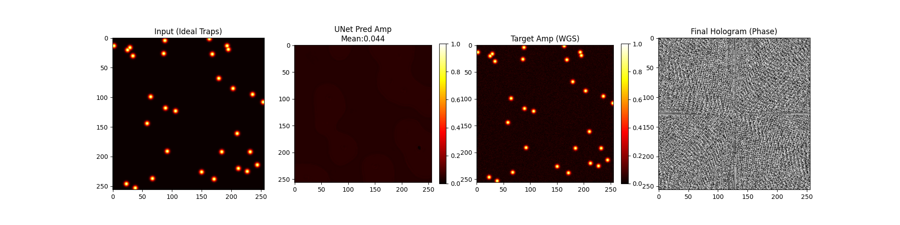
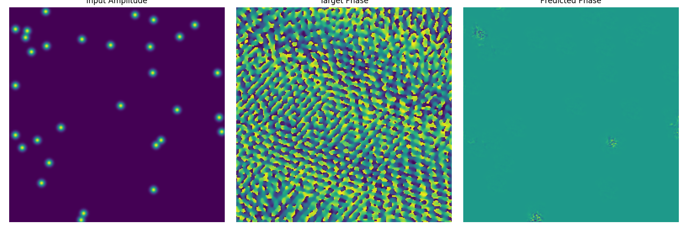
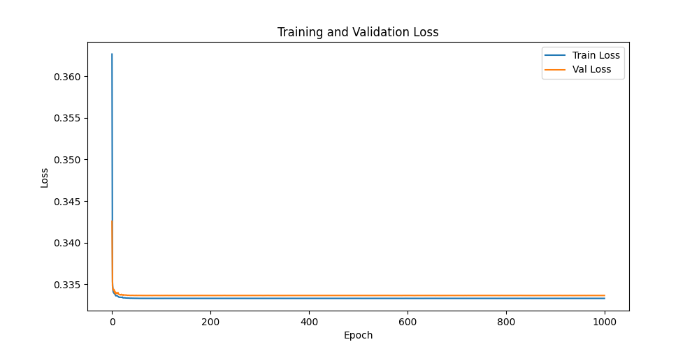

# AI Hologram Rearrangement

**Deep learning for constant-time hologram generation in large-scale neutral atom array rearrangement.**

[English](#english) | [中文](#chinese)

---

## English

### Overview

In neutral-atom quantum computing, Spatial Light Modulators (SLMs) generate holograms to produce optical tweezer arrays. The conventional **Weighted Gerchberg-Saxton (WGS)** algorithm iteratively computes the SLM phase mask, which is time-consuming for large arrays. This project trains deep neural networks to directly predict the optimal phase distribution from the target amplitude, achieving **constant-time hologram generation** — replacing hundreds of iterative Fourier transforms with a single neural network forward pass.

This work reproduces the core methodology from:

> *"Constant-time rearrangement of large-scale neutral atom arrays via artificial intelligence"* (2024).

### Results

| SLM Phase Mask | Reconstructed Trap Array | Training Loss |
|:---:|:---:|:---:|
|  |  |  |

### Project Structure

```
├── gs_algorithm/         # Weighted GS algorithm implementations (CPU & GPU)
├── AI/                   # Neural network models (ResNet, U-Net)
├── Hungary/              # Hungarian algorithm for atom rearrangement
├── tests/                # Data verification & test scripts
├── assets/               # Example output images
├── requirements.txt      # Python dependencies
└── README.md
```

> **Note**: The following directories are generated at runtime and excluded from the repository:
> - `gs_training_data*/` — HDF5 training datasets produced by GS scripts
> - `training_result*/` — Model checkpoints, loss curves, comparison figures

### Quick Start

**Requirements**: Python 3.8+, CUDA 11.x+ (for GPU-accelerated GS), PyTorch

```bash
pip install -r requirements.txt
```

> `cupy-cuda11x` should match your CUDA version (e.g., use `cupy-cuda12x` for CUDA 12.x).

**Workflow**:

```bash
# 1. Generate training data (WGS algorithm)
cd gs_algorithm
python GS_09_traindata_03.py
python GS_12.py

# 2. Train the AI model
cd ../AI
python AI_10.py    # U-Net (recommended)

# 3. View results in training_result*/
```

All scripts should be run from the **project root**.

### Model Architectures

| Version | Architecture | Input | Output | Loss |
|---------|-------------|-------|--------|------|
| AI_01~03 | ResNet (7 layers) | Amplitude (1-ch) | Phase (1-ch) | MSE |
| AI_04~07 | ResNet (14 layers) | Amp + Phase (2-ch) | Amp + Phase (2-ch) | PhaseAwareLoss |
| AI_08~10 | **U-Net** (4-level) | Amp + Phase (2-ch) | Amp + Phase (2-ch) | ComplexMSELoss |

The final U-Net features:
- 4-level encoder-decoder with skip connections
- Channel progression: 2 → 32 → 64 → 128 → 256 → 128 → 64 → 32 → 2
- Sigmoid on amplitude output, free phase
- Complex-domain loss: `‖E_pred − E_target‖²`

### License

MIT License — see [LICENSE](LICENSE) for details.

---

## 中文

### 简介

在中性原子量子计算中，空间光调制器 (SLM) 用于生成全息图来产生光镊阵列。传统方法使用**加权 Gerchberg-Saxton (WGS)** 迭代算法计算 SLM 相位掩模，耗时长、不适用于大规模阵列实时调控。本项目训练深度神经网络直接从目标振幅分布预测最优相位，以单次前向传播替代数百次傅里叶迭代，实现**常数时间全息图生成**。

本项目复现了：

> *"利用人工智能实现大规模中性原子阵列的常数时间重排"* (2024).

### 效果展示

| SLM 相位掩模 | 重建光镊阵列 | 训练 Loss 曲线 |
|:---:|:---:|:---:|
|  |  |  |

### 项目结构

```
├── gs_algorithm/         # 加权 GS 算法实现 (CPU & GPU 加速版)
├── AI/                   # 神经网络模型 (ResNet, U-Net)
├── Hungary/              # 匈牙利算法 (原子重排匹配)
├── tests/                # 数据验证与测试脚本
├── assets/               # 示例效果图
├── requirements.txt      # Python 依赖
└── README.md
```

> **注意**：以下目录由脚本运行时生成，不包含在仓库中：
> - `gs_training_data*/` — GS 算法生成的 HDF5 训练数据
> - `training_result*/` — 模型权重、loss 曲线、预测对比图

### 快速开始

**环境要求**：Python 3.8+, CUDA 11.x+ (GPU 加速 GS), PyTorch

```bash
pip install -r requirements.txt
```

> 请根据 CUDA 版本调整 `cupy-cuda11x`（CUDA 12.x 用 `cupy-cuda12x`）。

**运行流程**：

```bash
# 1. 生成训练数据 (WGS 算法)
cd gs_algorithm
python GS_09_traindata_03.py
python GS_12.py

# 2. 训练 AI 模型
cd ../AI
python AI_10.py    # U-Net (推荐)

# 3. 在 training_result*/ 查看结果
```

所有脚本需从**项目根目录**运行。

### 模型架构

| 版本 | 架构 | 输入 | 输出 | 损失函数 |
|------|------|------|------|---------|
| AI_01~03 | ResNet (7层) | 振幅 (1通道) | 相位 (1通道) | MSE |
| AI_04~07 | ResNet (14层) | 振幅+相位 (2通道) | 振幅+相位 (2通道) | PhaseAwareLoss |
| AI_08~10 | **U-Net** (4层级) | 振幅+相位 (2通道) | 振幅+相位 (2通道) | ComplexMSELoss |

最终选用的 U-Net 结构：
- 4 层级编码器-解码器 + 跳跃连接
- 通道变化：2 → 32 → 64 → 128 → 256 → 128 → 64 → 32 → 2
- 振幅输出经 Sigmoid 归一化，相位自由输出
- 复数域损失函数：`‖E_pred − E_target‖²`

### License

MIT License — 详见 [LICENSE](LICENSE)。

---

## References / 参考文献

- **Primary reference**: Authors et al., *"Constant-time rearrangement of large-scale neutral atom arrays via artificial intelligence"* (2024).  
  *利用人工智能实现大规模中性原子阵列的常数时间重排.*

- **WGS algorithm**: R. Di Leonardo, F. Ianni, and G. Ruocco, *"Computer generation of optimal holograms for optical trap arrays,"* Opt. Express 15, 1913–1922 (2007). [DOI: 10.1364/OE.15.001913](https://doi.org/10.1364/OE.15.001913)

- **Neutral atom arrays**: A. M. Kaufman and K.-K. Ni, *"Quantum science with optical tweezer arrays of ultracold atoms and molecules,"* Nat. Phys. 17, 1324–1333 (2021). [DOI: 10.1038/s41567-021-01357-2](https://doi.org/10.1038/s41567-021-01357-2)
